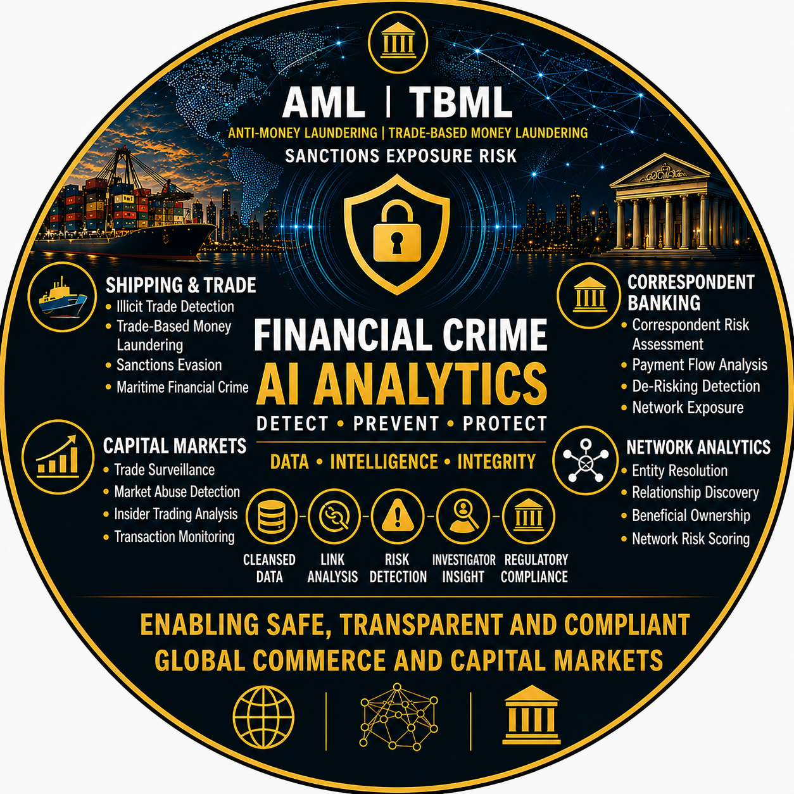

  

<h1 align="center">Dan Hartwig</h1>

  <strong>Financial Crime Transformation Portfolio</strong>

  Financial Crime Transformation • Network Intelligence • Advanced Analytics • Artificial Intelligence

  <em>Building intelligence-led operating models for the future of Financial Crime Operations.</em>

  

  

  Explore transformation frameworks, analytics assets, AI prototypes and intelligence-led operating model designs.

---

# 🌍 Portfolio Repositories

## 👉 [View Repository Portfolio](https://github.com/dhartwig-fc)

Explore the complete Financial Crime repository portfolio including analytics frameworks, network intelligence methodologies, AI-enabled operating models and transformation assets.

---

# 📊 Portfolio Highlights

| Area | Coverage |
|--------|--------|
| Capability Domains | Threat Intelligence, Detection Strategy, Analytics, Network Intelligence, AI, Governance |
| Analytics Coverage | AML, TBML, Banking, Sanctions, Capital Markets |
| AI Capabilities | Investigator Copilot, Alert Triage, SAR Assistance |
| Transformation Focus | Strategy, Governance, Operating Models, Delivery |

---

# Executive Profile

I am a Financial Crime Transformation professional specialising in intelligence-led capability design across AML, Sanctions, Trade Finance, Correspondent Banking, Network Intelligence and Artificial Intelligence.

My experience spans Financial Crime Operations, Transaction Monitoring, Detection Strategy, Analytics, Network Intelligence, Operating Model Design and Enterprise Transformation programmes.

This portfolio demonstrates how intelligence, analytics, network intelligence, AI and governance can be integrated into modern Financial Crime operating models.

Rather than presenting isolated technologies or analytical solutions, the portfolio demonstrates how emerging threats can be translated into operational detection capabilities, investigative workflows and measurable transformation outcomes.

---

# Core Capability Areas

| Domain | Focus Areas |
|----------|----------|
| 🧠 Threat Intelligence | Horizon Scanning, Threat Assessment, Geopolitical Intelligence, Emerging Typologies |
| 🎯 Detection Strategy | Threat-to-Detection Mapping, Scenario Engineering, Coverage Assessment |
| 📊 Analytics | Transaction Monitoring, Trade Finance Analytics, Correspondent Banking Analytics, Risk Scoring |
| 🕸️ Network Intelligence | Entity Resolution, Relationship Discovery, Beneficial Ownership, Graph Analytics |
| 🤖 Artificial Intelligence | Investigator Copilots, Alert Summarisation, SAR Assistance, AI Governance |
| 🏛️ Governance | Explainability, Controls, Model Oversight |
| 🚀 Transformation | Operating Models, Business Cases, Roadmaps, Executive Strategy |

---

# Featured Work

## 🧠 Emerging Threat Intelligence

Researching emerging financial crime threats, horizon scanning techniques and future capability requirements to support intelligence-led transformation.

### Focus Areas

- Artificial Intelligence Abuse
- Agentic AI
- Digital Assets
- Synthetic Identities
- Trade-Based Sanctions Evasion
- Geopolitical Risk Corridors
- Shadow Fleet Networks
- Professional Mule Networks

---

## 🕸️ Network Intelligence

Designing network intelligence frameworks supporting entity resolution, beneficial ownership analysis, relationship discovery and graph-based investigations.

### Focus Areas

- Entity Resolution
- Relationship Discovery
- Connected Party Analysis
- Beneficial Ownership Mapping
- Network Risk Scoring
- Graph Investigation Patterns

---

## 📊 Financial Crime Analytics

Development of analytics frameworks covering AML, Trade Finance, Correspondent Banking and Risk Scoring use cases.

### Focus Areas

- Transaction Monitoring
- TBML Analytics
- Risk Scoring
- Trade Intelligence
- Correspondent Banking Analytics
- Capital Markets Analytics

---

## 🤖 Artificial Intelligence

Applying AI to investigation workflows, alert triage, case summarisation and investigator productivity.

### Focus Areas

- AI Investigator Copilots
- Alert Summarisation
- Case Documentation Support
- SAR Narrative Generation
- Investigation Guidance

---

# Portfolio Navigation

| Repository | Purpose |
|------------|----------|
| Financial Crime Analytics Showcase | Visual showcase of analytics frameworks, typologies, network intelligence methodologies and AI-enabled operating models |
| Financial Crime Transformation Toolkit | Transformation, governance, architecture and delivery framework |
| Emerging Threat Intelligence | Horizon scanning, threat assessment and future capability research |
| AI Investigator Copilot | AI-enabled investigation support prototype |
| AML Alert Triage Prototype | Risk scoring and alert prioritisation prototype |

---

# Strategic Vision

Financial Crime organisations are increasingly challenged by complex threat landscapes, evolving regulatory expectations and rapidly emerging technologies.

The future operating model is intelligence-led, analytics-enabled and AI-assisted.

This portfolio explores how intelligence, detection strategy, analytics, network intelligence, investigations, governance and transformation can be connected into a coherent Financial Crime capability architecture.

---

# Disclaimer

This portfolio contains educational, conceptual and demonstration materials intended to illustrate Financial Crime transformation, analytics, network intelligence methodologies and AI-enabled operating models.

It does not contain client information, proprietary methodologies, production systems or confidential data.

---

# Contact

📧 dan_hartwig@hotmail.com

🔗 LinkedIn  
https://www.linkedin.com/in/dan-hartwig-financial-crime

💻 GitHub Repository Portfolio  
https://github.com/dhartwig-fc

---

© 2026 Dan Hartwig | Financial Crime Transformation Portfolio
`
